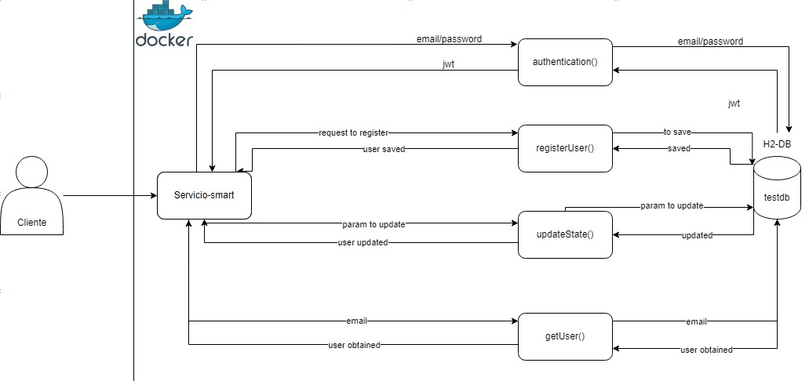

# Prueba técnica Evaluación Java
_Desarrolle una aplicación que exponga una API RESTful de creación de usuarios._
_Todos los endpoints deben aceptar y retornar solamente JSON, inclusive al para los mensajes de
error._ 
_Todos los mensajes deben seguir el formato:_ 
```
    {"mensaje": "mensaje de error"}
```

Registro: <br />
* _Ese endpoint deberá recibir un usuario con los campos "nombre", "correo", "contraseña",
más un listado de objetos "teléfono", respetando el siguiente formato:_ 
```
    {
        "name": "Wilmer Palomino",
        "email": "wpalomino@prueba.com",
        "password": "Elmaestro1$.",
        "phones": [
            {
                "number": "987654321",
                "citycode": "1",
                "contrycode": "57"
            }
        ]
    }
```
_Responder el código de status HTTP adecuado_
_En caso de éxito, retorne el usuario y los siguientes campos:_ 
* _id: id del usuario (puede ser lo que se genera por el banco de datos, pero sería
más deseable un UUID)_
* _created: fecha de creación del usuario_
* _modified: fecha de la última actualización de usuario_
* _last_login: del último ingreso (en caso de nuevo usuario, va a coincidir con la
fecha de creación)_
* _token: token de acceso de la API (puede ser UUID o JWT)_
* _isactive: Indica si el usuario sigue habilitado dentro del sistema._
* _Si caso el correo conste en la base de datos, deberá retornar un error "El correo ya
registrado"._
* _El correo debe seguir una expresión regular para validar que formato sea el correcto. (aaaaaaa@dominio.cl)_
* _La clave debe seguir una expresión regular para validar que formato sea el correcto. (El
valor de la expresión regular debe ser configurable)_
* _El token deberá ser persistido junto con el usuario_<br /><br />
_Requisitos_<br />
* _Plazo: 2 días, si tienes algún inconveniente con el tiempo comunicate con nosotros
* _Banco de datos en memoria. Ejemplo: HSQLDB o H2.
* _Proceso de build vía Gradle o Maven.
* _Persistencia con JPA. Ejemplo: EclipseLink, Hibernate u OpenJPA.
* _Framework SpringBoot.
* _Java 8+
* _Entrega en un repositorio público (github o bitbucket) con el código fuente y script de
  creación de BD.
* _Readme explicando cómo probarlo.
* _Diagrama de la solución.<br /><br />
_Requisitos opcionales_<br />
* _JWT como token
* _Pruebas unitarias
* _Swagger
# SOLUCIÓN

_Se realizaron servicios de autenticación, creación de usuarios, actualizar el estado del usuario y conseguir el usuario por el id._

## Pre-requisitos 📋

* _Las versiones son las siguientes: Java 17 y mvn 3.6.3 (pueden usar la versión embebida de IntelliJ)_
## Stack Tecnológicos 📋

_Java 17, H2, Maven, JPA, Spring Boot, Spring Security, jsonwebtoken, lombok, OpenAPI (Documentación)_

## Instalación: 🔧

_Para levantar localmente el servicio se puede realizar de 2 maneras:_

#### Con el IDE IntelliJ 🔧

* _Realizar un git clone al repositorio._
* _Abrir el proyecto con IntelliJ._
* _Realizar el comando maven:_
```
    mvn clean install
```
* _Ejecutar el proyecto con el Starter:_
* _Si entramos al siguiente link debería responder el siguiente Json:_
```
    http://localhost:8089/actuator/health
```
```
    JSON:
    {
        "status": "UP"
    }
```
* _Tendremos acceso a la documentación en el siguiente link:_
```
    http://localhost:8089/swagger-ui/index.html
```
#### Con Docker 🔧

* _Realizar un git clone al repositorio._
* _Abrir el proyecto con el explorador de archivos y abrir la terminal._
* _Realizar la siguiente secuencia de comandos:_

```
    mvn clean install
    docker build -t smart .
    docker run -d -p 8089:8089 -t smart:latest smart
```

## Probar con Postman 📋

_Para crear nuevos usuarios._
```
    http://localhost:8089/v1/user/register
```
_Para actualizar el estado. (Cambiar el email y el state por los valores deseados) el email debe tener el formato de correo y el state puede ser "true" o "false"._
```
    http://localhost:8089/v1/user/update/state?email={email}@prueba.com&state={email}
```
_Para obtener el usuario por email._
```
    http://localhost:8089/v1/user?email={email}
```
_Para generar el JWT mediante el logeo de un usuario. Tener en cuenta que la data de prueba proporcionada es el usuario que se registra cuando se inicia la aplicación. Con esta data generaremos el JWT necesario para crear nuevos usuarios._
```
    http://localhost:8089/v1/auth
    Request para generar el JWT:
    {
        "email": "wpalomino@prueba.com",
        "password": "Elmaestro1$"
    }
```

## Diagrama de Solución 📋

---
⌨️ por [Wilmer Palomino](https://github.com/WilGP02) 😊